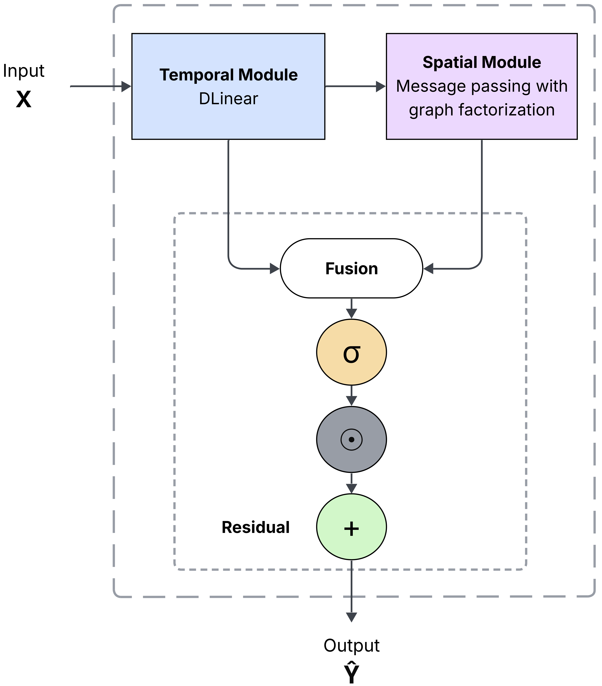

# Lite-STGNN

Official PyTorch implementation of **Lite-STGNN: A lightweight Spatial-Temporal Graph Neural Network for Long-term Time Series Forecasting**

[](https://arxiv.org/abs/2512.17453)
[](https://icaart.scitevents.org/)
[](https://www.python.org/downloads/)
[](https://pytorch.org/)
[](https://opensource.org/licenses/MIT)

> **Accepted to be presented at ICAART 2026** | [Paper](https://arxiv.org/abs/2512.17453)

## Get Started

### 1. Install Dependencies
```bash
pip install -r requirements.txt
```

### 2. Download Data
All datasets can be obtained from [Time-Series-Library](https://github.com/thuml/Time-Series-Library).

Place datasets in `./data/`:
```
data/
├── electricity.csv
├── traffic.csv
├── exchange_rate.csv
└── weather.csv
```

### 3. Run Experiments

**Reproduce Paper Results:**
```bash
bash scripts/reproduce_paper_results.sh
```

**Or run individual experiments:**
```bash
python src/lite_stgnn_modular.py \
  --dataset electricity \
  --data-root ./data \
  --seq-len 96 --pred-len 720 --epochs 50 \
  --learning-rate 5e-4 \
  --adj-rank 16 --adj-topk 10 --adj-tau 1.2 \
  --use-input-residual \
  --use-temporal-head --temporal-head-ratio 0.5 \
  --residual-dropout 0.1 \
  --gate-mode band --prop-orders 2
```

## Architecture

Lite-STGNN combines temporal modeling with learnable spatial dependencies for efficient long-term time-series forecasting:

<div align="center">
  
</div>

**Key Components:**
- **Temporal Modeling** (Dlinear): Trend-seasonal decomposition with separate linear projections
- **Learnable Adjacency Matrix**: Low-rank factorization with TopK sparsification for discovering spatial dependencies
- **Graph Propagation**: Multi-hop spatial aggregation with learnable graph structure
- **Residual Gating**: Adaptive horizon-wise weighting mechanism
- **Optional Enhancements**: Temporal refinement head, input skip connections, feature normalization

## Citation

If you find this work useful, please cite our paper:

```bibtex
@inproceedings{moges2026litestgnn,
  title={A lightweight Spatial-Temporal Graph Neural Network for Long-term Time Series Forecasting},
  author={Moges, H.T. and Moodley, D.},
  booktitle={Proceedings of the 18th International Conference on Agents and Artificial Intelligence (ICAART)},
  year={2026},
  note={arXiv:2512.17453}
}
```

**arXiv preprint:** https://arxiv.org/abs/2512.17453

## Acknowledgement

We appreciate the following repositories for their valuable code and datasets:

- [Time-Series-Library](https://github.com/thuml/Time-Series-Library) - Benchmark datasets 
- [LTSF-Linear](https://github.com/cure-lab/LTSF-Linear) - DLinear implementation

## License

MIT License
